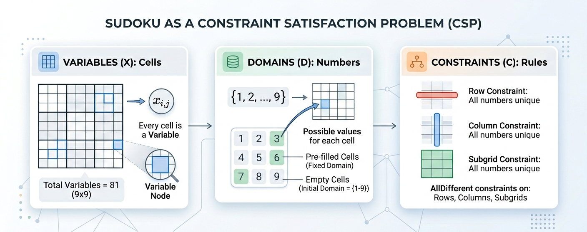
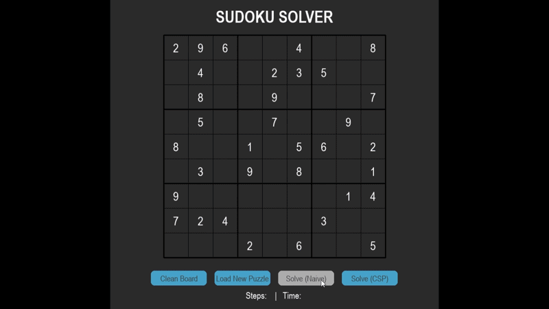
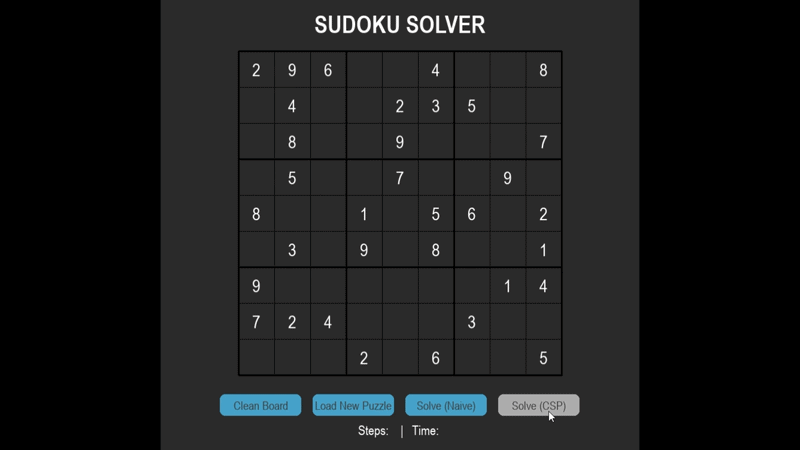

## Overview

This project explores how different search strategies and constraint satisfaction techniques affect the performance of a Sudoku solver. Starting from a naive backtracking approach, the project progressively adds heuristics such as MRV (Minimum Remaining Values) and LCV (Least Constraining Value), and evaluates their impact on solving efficiency.

The codebase is structured to support multiple solver implementations, a benchmarking system to compare performance across puzzles, and a visualization tool to observe the solving process step-by-step. 

## Problem Framing

Sudoku can be modeled as a Constraint Satisfaction Problem (CSP): each cell is a variable, and constraints enforce that values do not repeat within rows, columns, or subgrids.
Despite the simplicity of the rules, the search space grows rapidly. This makes Sudoku a useful testbed for comparing search strategies, where small changes in variable or value selection can lead to significant differences in performance.

  

## Solver Progression

The project follows a progression of increasingly informed search strategies, where each solver builds on the previous one.

### Naive Backtracking
Selects the next empty cell in a fixed order and tries values sequentially.  
This approach is simple and guarantees correctness, but explores a large search space and performs poorly on harder puzzles.

### MRV (Minimum Remaining Values)
Selects the cell with the fewest valid candidates at each step.  
Instead of filling cells in a fixed order, MRV prioritizes the most constrained variables. This increases the chance of detecting conflicts early, reducing unnecessary branching and limiting the size of the search tree.

### MRV + LCV (Least Constraining Value)
Extends MRV by ordering candidate values based on how little they restrict neighboring cells.  
This helps delay conflicts and reduces backtracking.

### MRV + Forward Checking
In this approach, after each assignment, invalid values are removed from neighboring cells.  
This reduces future conflicts but introduces additional overhead, creating a tradeoff between pruning effectiveness and runtime.

## Results

### Average Performance Across All Puzzles

| Solver                | Avg Time (s) | Median Time (s) | Avg Nodes | Avg Backtracks | Avg Assignments |
|---------------------|-------------|-----------------|-----------|----------------|-----------------|
| Naive Backtracking  | 1.15        | 0.46            | 165,040   | 164,984        | 165,039         |
| MRV                 | 1.20        | 0.60            | 5,173     | 5,117          | 5,172           |
| MRV + LCV           | 1.20        | 0.97            | 4,766     | 4,710          | 4,765           |
| MRV + Forward Check | 1.33        | 0.82            | 4,742     | 5,117          | 5,172           |

Median values indicate that most puzzles are solved quickly, while a smaller number of difficult instances dominate the average runtime.

## Key Insights

- **MRV significantly reduces the search space**  
  Compared to naive backtracking, MRV reduces the number of explored nodes by over 30×, confirming that variable selection has a major impact on search efficiency.

- **Runtime does not directly follow search reduction**  
  Despite the large drop in nodes, MRV shows similar runtime to the naive solver. The overhead of computing candidate domains offsets part of the gain.

- **LCV improves search efficiency with minimal runtime impact**  
  Adding LCV further reduces nodes and backtracking, but does not significantly change runtime. The benefit is mainly in improving the quality of the search rather than execution speed.

- **Forward checking introduces overhead without clear runtime benefit**  
  Although forward checking slightly reduces the number of explored nodes, it results in higher overall runtime. The cost of maintaining domain consistency outweighs its pruning advantage in this implementation.

- **Search cost vs computation cost is a key tradeoff**  
  These results show that reducing the search space alone is not enough — the cost of each step must also be considered.

## Implementation Note

In this implementation, the domain (valid values for each cell) is recomputed at every step instead of being stored and updated incrementally.

This keeps the solver simpler, but adds overhead — especially for MRV, LCV, and forward checking, which rely heavily on domain calculations. As a result, even though these approaches reduce the number of explored states, the runtime improvement is limited.

A more optimized approach would maintain and update domains as the search progresses. This would likely reduce the overhead and better reflect the expected performance gains from these heuristics.

## Vizuale Example Comparison
### Naive Solver — 262 moves, ~34 seconds

### CSP Solver — 48 moves, ~7 seconds

